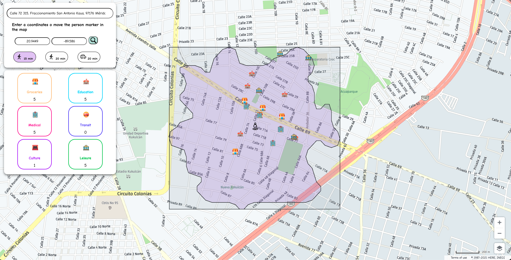

# 15-min-city-map

This project aims to demonstrate the functionality of the following HERE Technologies APIs:

- [HERE Maps API for Javascript v3.1.x.x](https://developer.here.com/documentation/maps/3.1.30.3/dev_guide/index.html)
- [HERE Isoline Routing API v8](https://developer.here.com/documentation/isoline-routing-api/api-reference-swagger.html)
- [HERE Geocoding & Search API v7](https://developer.here.com/documentation/geocoding-search-api/api-reference-swagger.html)
  - Geocode
  - Browse
  - Reverse Geocode

And it does it through a practical example:

What places can I reach with certain time and means of transport?  

*Example Image*